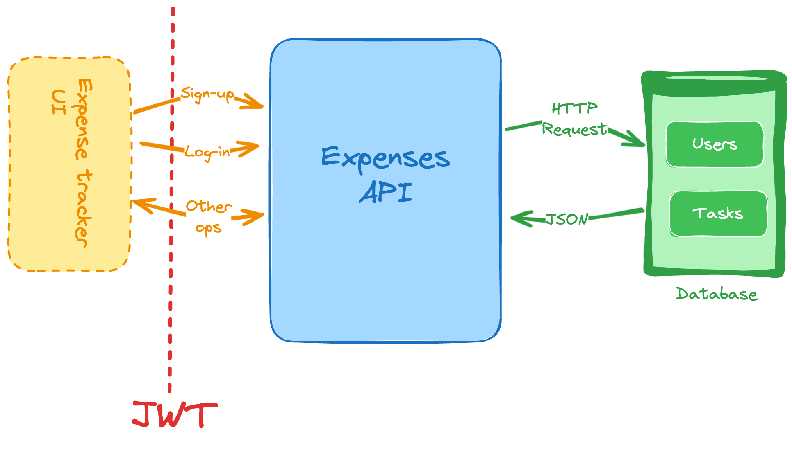

https://roadmap.sh/projects/expense-tracker-api

## Requirements:

- Build an API for an expense tracker application. This API should allow users to create, read, update, and delete expenses. 
- Users should be able to sign up and log in to the application and each user should have their own set of expenses. 




###### The user should be able to:

- Register / Sign up as a new user.

- Validate and Authenticate registered user profile.

- Add a new expense

- Update existing expense

- Delete existing expense

- List and filter past expenses. Can add following filters:
	- Past week
	- Past month
	- Last 3 months
	- Custom (specify start and end date of choice)
	- Category

---
## Features:

#### Authentication:

- POST - Register :
```
api/v1/auth/regiter
```

- POST - Login:

```
api/v1/auth/login
```
#### Expenses:

- POST - Create Expense:

```
api/v1/expenses
```

- GET - Get Expense:

```
api/v1/expenses/{expense_id}
```

- GET - List Expenses:

```
api/v1/expenses
```

- PATCH - Update Expense.

```
api/v1/expenses/{expense_id}
```

- DELETE - Delete Expense.

```
api/v1/expenses/{expense_id}
```

---
## Example
  
Authentication:

```bash

# Register:
Request schema: 
	- username: string
	- email: string EmailStr
	- password: string

Response schema:
	- id: interger
	- username: string
	- email: string EmailStr

# Login:

Request schema:
	- username / email : string
	- password: string

Response schema:
	- access_token: string
	- token_type: string

```


Expenses:

```bash

# Create Expense:

Request schema:
	- title: string
	- note: string | null
	- amount: Decimal
	- category: string Enum

Response schema:
	- id: integer
	- title: string
	- note: string | null
	- amount: Decimal
	- category: string Enum
	- created_at: datetime

# Get Expense by ID:

Request schema:
	- id: integer

Response schema:
	- id: integer
	- title: string
	- note: string | null
	- amount: Decimal
	- category: string Enum
	- created_at: datetime
	  
# Update Expense:

Request schema:
	- expense_id: integer
	  
	- title: string | null
	- note: string | null
	- amount: Decimal | null
	- category: string Enum | null
	  
Response schema:
	- id: integer
	- title: string
	- note: string | null
	- amount: Decimal
	- category: string Enum
	- created_at: datetime

# List Expenses:

Request schema:
	Filters:
	- timeline: string Enum | null
	- category: string Enum | null
	- start: string date | null
	- end: string date | null

Response schema:
	Expenses [
		{
			- id: 1
			- title: string
			- note: string | null
			- amount: Decimal
			- category: string Enum
			- created_at: datetime
		},
		{
			- id: 2
			- title: string
			- note: string | null
			- amount: Decimal
			- category: string Enum
			- created_at: datetime
		}
	]


# Delete Expense:

Request schema:
	- expense_id: integer  
Response schema:
	- 204 success message

```

